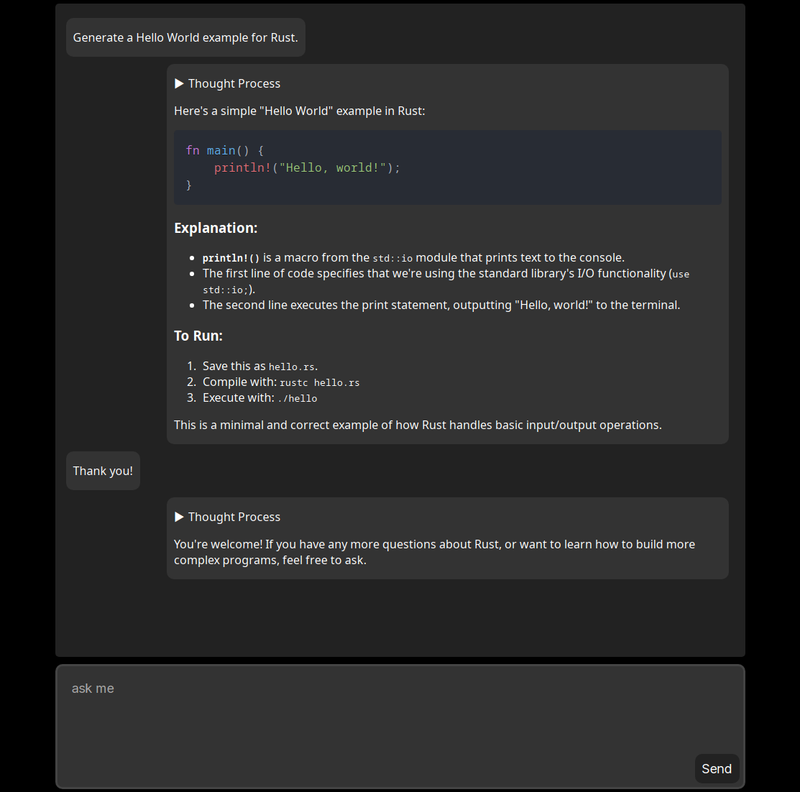

# Local Platy
A desktop application built with Tauri and React for running Large Language Models locally. It uses llama-cpp-2 to load and interact with GGUF models directly on your machine. The goal is to provide a simple, one-click solution that works without complex setup.

## Features
* Local Desktop Application: Built with Tauri to run entirely offline.
* UI: Built entirely on React with TypeScript.
* GGUF Support: Built-in compatibility for GGUF models via llama-cpp-2.
* Open Source: Simple codebase designed for modification and personal use.

## Installation 
For the quickest setup with Qwen3 1.7b, download the pre-compiled executable for your platform from the latest GitHub release.

## How to build from source with Deno:
1. Install Dependencies: Run `deno install` to fetch all necessary packages.
2. Prepare Model: Copy your GGUF model to `./src-tauri/models/` and rename it to `model.gguf`.
3. Development: Run the development task via `deno task tauri dev`.
4. Build: Create the executable abb or apk using `deno task tauri build`.

## (Experimental) How to build for Android devices:
This has been tested with Android emulators. You’ll need the Android NDK 26.1.10909125 to run the build process.

1. Install Dependencies: Run `deno install` to fetch all necessary packages.
2. Prepare Model: Copy your GGUF model to `./src-tauri/models/` and rename it to `model.gguf`.
3. Development: Run the development task via `deno task tauri android dev` to run on android emulators using Android studio.
4. Build: Create the AAB and APK executables using `deno task tauri android build --target aarch64` for AArch64 devices or `deno task tauri android build --target armv7` for ARMv7 devices.

## Note 
This application is currently developed and tested on Linux using the Qwen3-1.7B model. Support for other platforms and models is ongoing.
